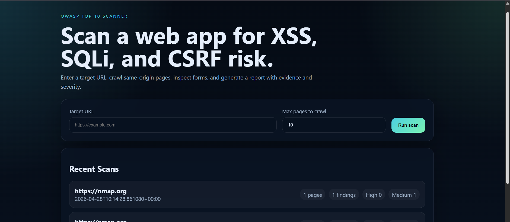
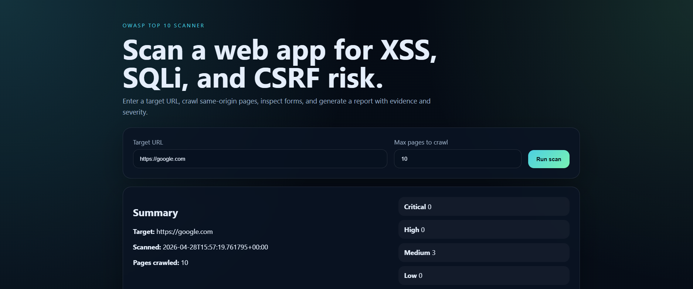
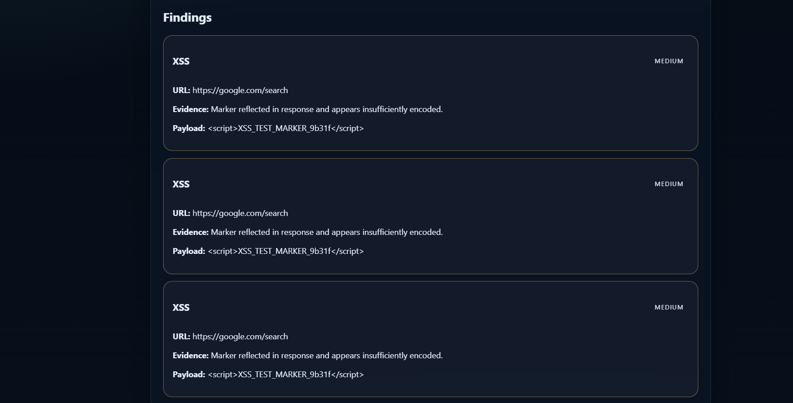
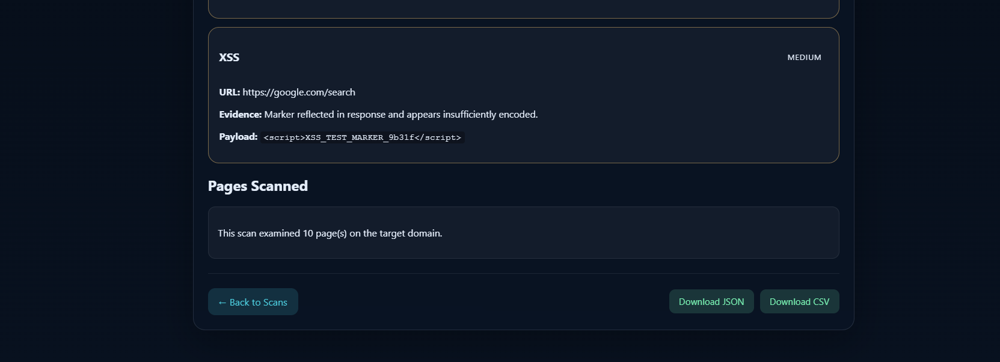

# 🛡️ Web Application Vulnerability Scanner (WAVS)

WAVS is a lightweight, Flask-based security tool designed to automate web application vulnerability assessments. It crawls target URLs to discover input vectors and heuristically flags common OWASP Top 10 risks.

---

## 📸 Project Showcase (Screenshots)

### 🖥️ Dashboard & Monitoring
A centralized interface to configure target URLs and visualize real-time scan statistics.

### 🔍 Vulnerability Reports & History
Deep dive into specific findings with evidence, along with the ability to export reports and track historical scan data.

---

## 🔥 Key Features
- **Automated Crawler:** Recursively discovers same-origin links and maps out the target's attack surface.
- **Security Testing:**
  - **Reflected XSS:** Tests input fields for malicious script injection.
  - **SQLi Detection:** Identifies database error leakage and potential SQL injection points.
  - **Header Analysis:** Detects missing CSRF tokens and weak security headers.
- **Reporting & Storage:** All scan results are stored in a local SQLite database, allowing users to export findings as JSON or CSV.

---

## 🛠️ Setup & Installation

Follow these steps to get the scanner running on your local machine:

**1. Clone the Repository:**
`git clone https://github.com/ayushkp930/Web-Application-Vulnerability-Scanner.git`
`cd Web-Application-Vulnerability-Scanner`

**2. Create Virtual Environment:**
`python -m venv venv`

**3. Activate Environment:**
- **Windows:** `.\venv\Scripts\activate`
- **Linux/macOS:** `source venv/bin/activate`

**4. Install Dependencies:**
`pip install -r requirements.txt`

**5. Launch Application:**
`python app.py`

> **Access the scanner at:** [http://127.0.0.1:5000](http://127.0.0.1:5000)

---

