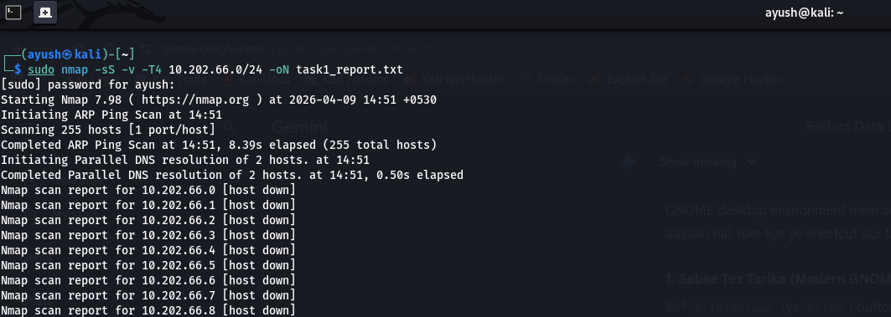
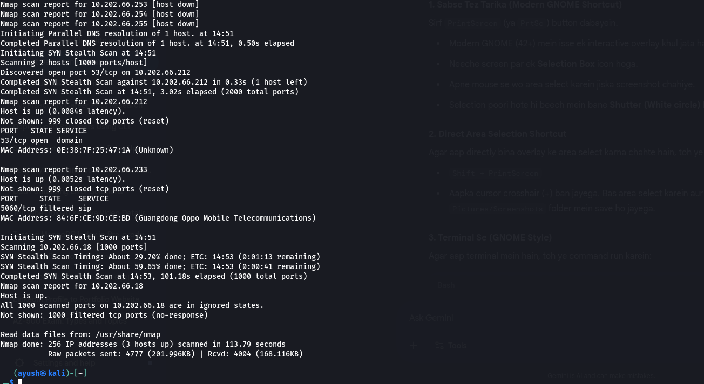
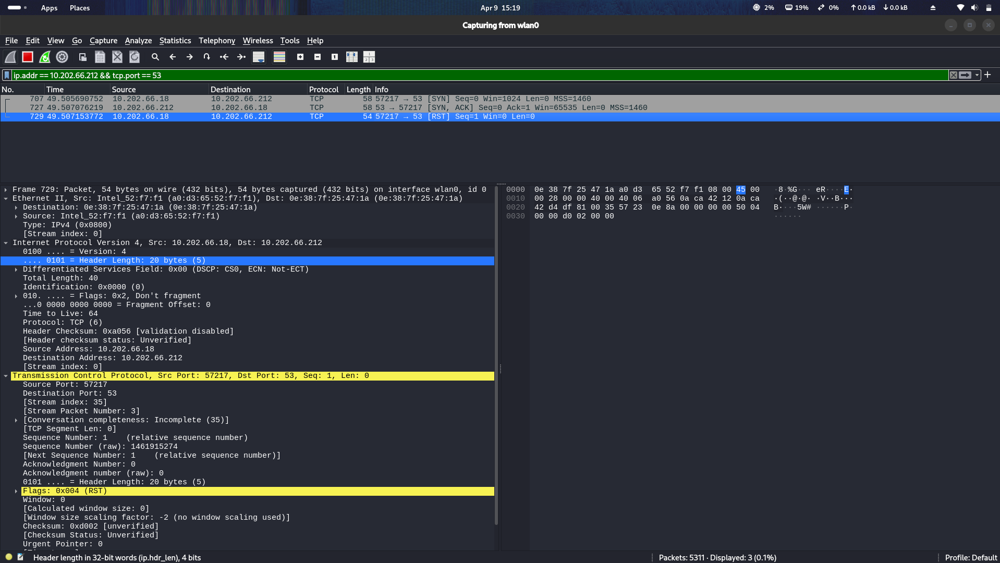

# 🎯 Task 01: Network Reconnaissance & Port Scanning

## 📌 Executive Summary
As part of the **Elevate Labs Cyber Security Internship**, this project focuses on the reconnaissance phase of the Cyber Kill Chain. The primary objective was to perform a non-intrusive network scan on a local subnet to map active hosts, identify open services, and analyze network traffic behavior using **Nmap** and **Wireshark**.

## 🛠️ Technical Environment
| Component | Details |
| :--- | :--- |
| **Operating System** | Kali Linux (GNOME) |
| **Primary Tool** | Nmap 7.98 |
| **Packet Analyzer** | Wireshark |
| **Target Subnet** | `10.202.66.0/24` |
| **Scan Type** | TCP SYN (Stealth) Scan (`-sS`) |

---

## 🚀 Methodology: The Stealth Scan
A "Half-Open" (TCP SYN) scan was utilized to minimize detection probability while maintaining high accuracy.

**Execution Command:**
`sudo nmap -sS -v -T4 10.202.66.0/24 -oN task1_report.txt`

**Command Breakdown:**
* `-sS`: **TCP SYN Stealth Scan** - Bypasses the full 3-way handshake to evade basic logging.
* `-v`: **Verbose Mode** - Provides real-time feedback during execution.
* `-T4`: **Aggressive Timing** - Optimizes scan speed for reliable local networks.
* `-oN`: **Normal Output** - Exports results to a structured text file (`04_scan_report.txt`).

---

## 🔍 Key Findings

The scan successfully mapped the subnet and identified **3 active hosts**:

| IP Address | Status | Port/Protocol | Service | Observation |
| :--- | :--- | :--- | :--- | :--- |
| **`10.202.66.212`** | UP | `53/tcp` (Open) | DNS | Active Domain Name System resolution service. |
| **`10.202.66.233`** | UP | `5060/tcp` (Filtered) | SIP | Mobile device (Oppo). VoIP/SIP traffic is filtered. |
| **`10.202.66.18`** | UP | All 1000 Filtered | Localhost | Scanning machine. Internal firewall is dropping external probes. |

*(Full raw output is documented in the repository: `04_scan_report.txt`)*

---

## 📸 Proof of Concept (Visual Evidence)

### 1. Nmap Command Execution
*Deployment of the aggressive SYN scan against the target subnet.*

### 2. Scan Results Summary
*Successful discovery of active hosts and their respective port states.*

### 3. Traffic Analysis via Wireshark
*Packet-level validation of the stealth scan (observing the `SYN` ➔ `SYN/ACK` ➔ `RST` flow).*

---

## 🧠 Security Analysis & Technical Validation

**Q1: What defines an "Open Port"?**
> An open port indicates a network service is actively listening and accepting incoming TCP/UDP connections (e.g., Port 53 on `.212`).

**Q2: Explain the mechanics of a TCP SYN Scan.**
> Also known as a "Half-Open" scan. The scanner sends a `SYN` packet. If the target replies with `SYN/ACK`, the port is open. To remain stealthy, the scanner immediately sends a `RST` (Reset) packet to tear down the connection before it is logged by the target application.

**Q3: What are the security implications of an open DNS port (53)?**
> If misconfigured, open DNS ports can be weaponized for DNS Cache Poisoning, Zone Transfers (information disclosure), or DNS Amplification (DDoS) attacks.

**Q4: What does a "Filtered" state signify (e.g., Port 5060)?**
> It means a network obstacle (like a firewall or IDS/IPS) is silently dropping the probes. Nmap cannot determine if the port is truly open or closed.

**Q5: Why did the local host (10.202.66.18) show all ports as filtered?**
> The local operating system's firewall is active and configured to drop unauthorized incoming ICMP/TCP probes.

**Q6: What are the general risks of unnecessary open ports?**
> They unnecessarily increase the "Attack Surface," providing threat actors with potential entry points for exploitation, brute-force attacks, or unauthorized access.

**Q7: How can these ports be secured?**
> 1. Apply the Principle of Least Privilege. 2. Implement strict firewall rules (e.g., iptables/UFW). 3. Disable unused services. 4. Ensure all active services are patched and hardened.

**Q8: Why is Network Reconnaissance critical?**
> Reconnaissance is the foundation of both offensive and defensive security. For defenders, identifying exposed services proactively is the first step in shrinking the attack surface before attackers can exploit vulnerabilities.

---
**Author:** Ayush Kumar Patel | **Role:** Cyber Security Intern @ Elevate Labs
