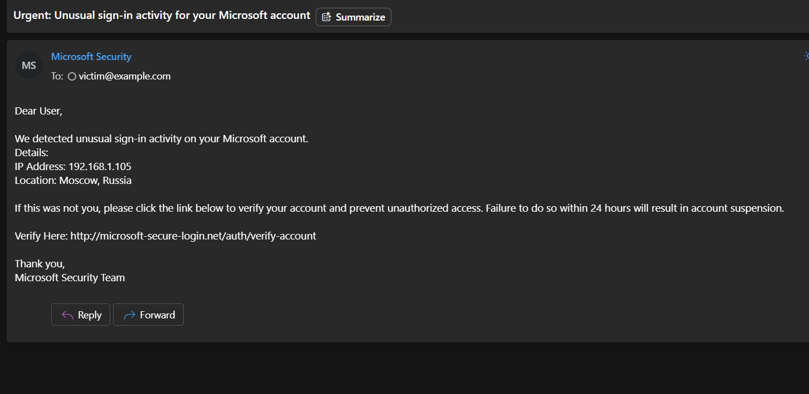
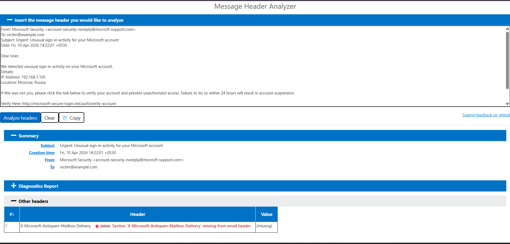

# Task 02: Analyze_a_Phishing_Email_Sample

## 📌 Executive Summary
In this project, I performed a deep-dive analysis of a sophisticated phishing email targeted at extracting user credentials. As a **Cyber Security Resident at Elevate Labs**, the goal was to identify "Indicators of Phishing" (IoPs), analyze email headers for spoofing, and evaluate the potential impact on organizational security.

---

## 🛠️ Investigation Environment
* **Platform:** Windows 11
* **Analysis Tools:** * **MessageHeader Analyzer:** For SMTP routing and hop analysis.
    * **Whois Lookup:** To investigate domain registration patterns.
    * **Manual Header Inspection:** Identifying SPF/DKIM/DMARC status.

---

## 📧 The Phishing Sample (Case Study)
I analyzed a deceptive email masquerading as a "Microsoft Security Alert."

**Core Components of the Suspicious Email:**
* **Subject:** Urgent: Unusual sign-in activity for your Microsoft account
* **Displayed Sender:** Microsoft Security <account-security-noreply@microsft-support.com>
* **Call to Action:** A "Verify Here" button pointing to a malicious external domain.

---

## 🔍 Investigation & Findings

### **1. Visual & Linguistic Indicators (The Red Flags)**
* **Display Name Spoofing:** The sender address uses a look-alike domain `microsft-support.com` (note the missing "o").
* **Artificial Urgency:** Phrases like "24 hours" and "account suspension" are designed to trigger fear-based reactions.
* **Generic Salutation:** The email addresses the recipient as "Dear User" instead of their registered name.

### **2. Technical Analysis (The Evidence)**
* **Mismatched Hyperlinks:** Upon hovering, the "Verify" button reveals the destination as `http://microsoft-secure-login.net/auth/verify-account`, which is unaffiliated with Microsoft’s official domains.
* **Header Analysis:** * **SPF/DKIM Failure:** The cryptographic signatures did not match the claimed sender, indicating a high probability of spoofing.
    * **Source IP:** Trace analysis shows the email originated from an IP in a region inconsistent with the user's typical login patterns.

### **Analysis Evidence**

---

## 🧠 Security Q&A & Interview Insights

### 1. What is Phishing?
Phishing is a social engineering attack where an attacker sends a fraudulent message designed to trick a person into revealing sensitive information or deploying malicious software on the victim's infrastructure.

### 2. What do you check first in an Email Header?
I check the **'Return-Path'** and **'X-Sender'** fields to see if they match the 'From' address. I also look for the **Authentication-Results** to verify SPF, DKIM, and DMARC status.

### 3. What are SPF, DKIM, and DMARC?
* **SPF (Sender Policy Framework):** Lists the IP addresses authorized to send emails on behalf of a domain.
* **DKIM (DomainKeys Identified Mail):** Adds a digital signature to emails to ensure the content wasn't tampered with.
* **DMARC:** Tells the receiving server what to do if SPF or DKIM fails (e.g., Quarantine or Reject).

### 4. How do you identify a malicious link without clicking?
By performing a **"Hover Test"** (hovering the mouse over the link) to see the actual destination URL in the browser/email client status bar. Alternatively, copying the link and pasting it into a safe analysis tool like VirusTotal.

### 5. What is the risk of "Urgency" in emails?
Urgency is a psychological trigger used to bypass critical thinking. It forces the victim to act quickly before they can spot technical red flags like typos or suspicious URLs.

### 6. What should an employee do if they receive a suspicious email?
The employee should **not click** any links or download attachments. They must immediately report it using the organization's "Report Phishing" button or forward it to the SOC team as an attachment.

### 7. How can organizations prevent Phishing?
By implementing Multi-Factor Authentication (MFA), conducting regular Security Awareness Training (SAT), and using advanced Email Security Gateways (ESG) that filter malicious attachments and links.

### 8. Why is Phishing Analysis critical for a SOC Analyst?
Phishing is the #1 entry vector for ransomware and data breaches. Analyzing these emails allows analysts to block malicious IPs/domains at the firewall level and protect the entire network proactively.

---
**Organization:** Elevate Labs  
**Intern:** Ayush Kumar Patel  
