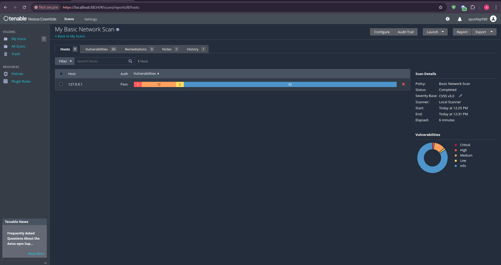
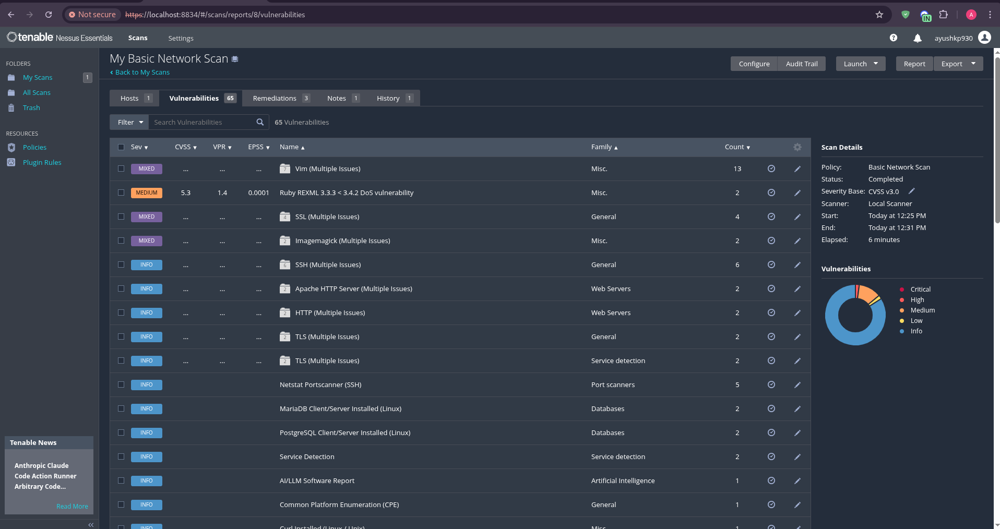
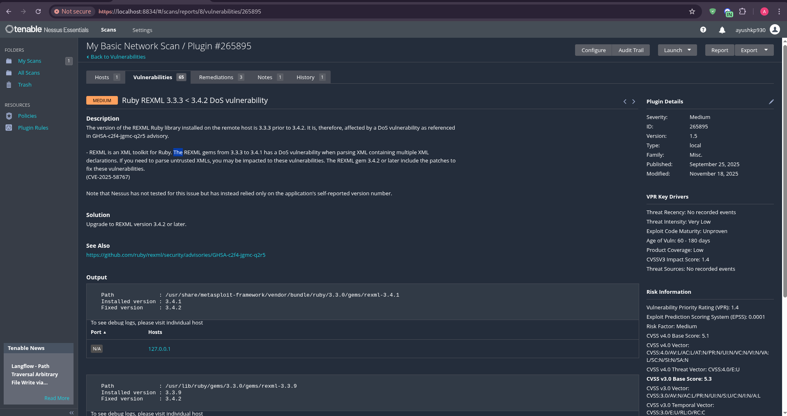
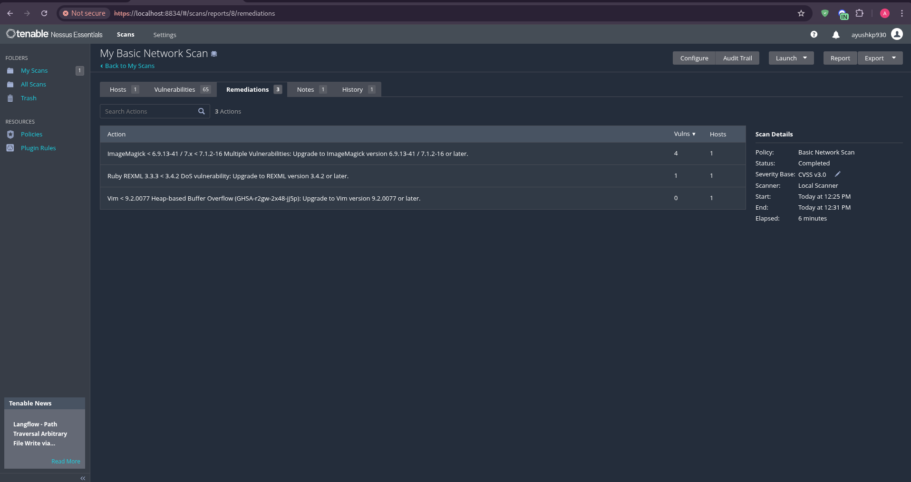

# Vulnerability Assessment & Mitigation (Task 3)

## 📌 Project Overview
This project involves performing an automated vulnerability assessment on a local Linux environment (`[REDACTED]`) using **Nessus Essentials**. The objective was to identify security flaws, analyze their severity based on the CVSS framework, and propose effective mitigation strategies.

## 🛠️ Tools Used
* **Operating System:** Kali Linux
* **Scanner:** Nessus Essentials
* **Target:** Local Machine ([REDACTED])

---

## 📊 Key Findings & Mitigation Strategies

**Nessus Scan Dashboard Summary:**

During the scan, 65 vulnerabilities were identified. Fortunately, no "Critical" or "High" severity vulnerabilities were found. 

**List of Detected Vulnerabilities:**

Below are the top "Medium" severity findings:

### 1. Ruby REXML 3.3.3 < 3.4.2 DoS Vulnerability
* **Severity:** Medium
* **Description:** The REXML gem is vulnerable to a Denial of Service (DoS) attack when parsing multiple XML declarations.
* **Mitigation:** Upgrade the REXML version to 3.4.2 or higher.

*Proof of Finding:*

### 2. ImageMagick Multiple Vulnerabilities
* **Severity:** Medium
* **Description:** Outdated versions of ImageMagick contain flaws that could allow memory corruption or arbitrary code execution under specific conditions.
* **Mitigation:** Upgrade ImageMagick to version 6.9.13-41 / 7.1.2-16 or later.

### 3. Vim Heap-based Buffer Overflow
* **Severity:** Medium
* **Description:** A heap-based buffer overflow exists in Vim, which could potentially lead to a crash or unintended behavior.
* **Mitigation:** Update Vim to version 9.2.0077 or newer.

*Proof of Findings (ImageMagick & Vim):*

---

## 💡 Interview Questions & Technical Answers

**Q1: What is CVSS?**
**Answer:** CVSS stands for Common Vulnerability Scoring System. It is an open, industry-standard framework used to assess the severity of computer system security vulnerabilities. It assigns a numerical score (0 to 10) to help security teams prioritize responses (Low, Medium, High, Critical).

**Q2: What is a False Positive in vulnerability scanning?**
**Answer:** A false positive occurs when a scanning tool incorrectly flags a secure file, application, or configuration as vulnerable. It requires manual verification by a security analyst to confirm whether the threat is real or just an error by the scanner.

**Q3: What is the difference between Credentialed and Non-Credentialed scans?**
**Answer:** A non-credentialed scan checks for vulnerabilities from an external viewpoint without logging into the target system, often missing deep system flaws. In contrast, credentialed assessments have a higher chance of finding OS-related vulnerabilities than non-credentialed ones because they use valid login credentials to thoroughly inspect local files, registries, and missing patches from the inside.

**Q4: How do you prioritize which vulnerabilities to patch first?**
**Answer:** Vulnerabilities should be prioritized based on three factors:
1. **CVSS Score:** Fixing Critical and High vulnerabilities first.
2. **Exploitability:** Whether an exploit code already exists in the wild (e.g., in Metasploit).
3. **Asset Criticality:** A vulnerability on a public-facing web server is patched before a vulnerability on an isolated internal machine.

**Q5: What is the difference between Mitigation and Remediation?**
**Answer:** Remediation completely eliminates the vulnerability (e.g., applying a software patch). Mitigation reduces the impact or likelihood of the vulnerability being exploited when a direct patch isn't immediately available (e.g., blocking a specific port on the firewall).
