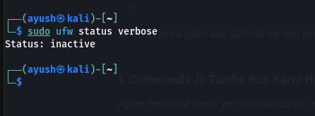
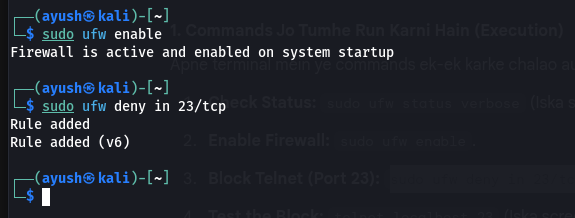
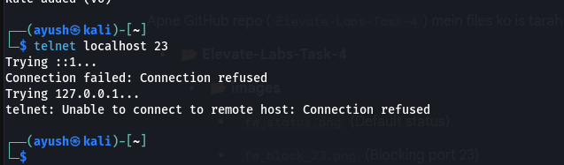
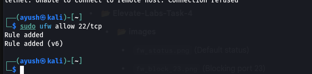

# Elevate Labs Cyber Security Internship - Task 4
## Firewall Configuration and Traffic Filtering (UFW)

### 🎯 Objective
To configure and test basic firewall rules using UFW (Uncomplicated Firewall) on Linux to manage inbound and outbound traffic effectively.

---

### 💻 Environment Details
- **OS:** Kali Linux
- **Firewall Tool:** UFW (Uncomplicated Firewall)
- **Status:** Active & Configured

---

### 🚀 Implementation Steps & Screenshots

#### 1. Initial Firewall Status
I started by checking the current status of the firewall and ensuring it was active.

#### 2. Blocking Insecure Ports (Port 23)
Added a specific rule to deny all inbound traffic on Port 23 (Telnet) to secure the system from plain-text communication vulnerabilities.

#### 3. Verification of Block Rule
Tested the rule by attempting a Telnet connection. The firewall successfully refused the connection.

#### 4. Allowing Essential Services (Port 22)
Configured a rule to permit inbound traffic on Port 22 for secure SSH access.

---

### 📝 Interview Questions & Answers

**1. What is a firewall?**
A network security system that monitors and controls incoming and outgoing network traffic based on predetermined security rules.

**2. Difference between stateful and stateless firewall?**
Stateful firewalls track the state of active connections and make decisions based on the context of the traffic flow. Stateless firewalls inspect packets individually without considering the connection state.

**3. What are inbound and outbound rules?**
Inbound rules control traffic entering the network/device, while outbound rules control traffic leaving it.

**4. How does UFW simplify firewall management?**
It provides a user-friendly, command-line interface for managing iptables, making it easier to add, remove, and monitor rules.

**5. Why block port 23 (Telnet)?**
Telnet is an unencrypted protocol that sends data (including credentials) in plain text, making it highly vulnerable to packet sniffing and MITM attacks.

**6. What are common firewall mistakes?**
Failing to update rules regularly, leaving "Any-to-Any" allow rules, and not monitoring firewall logs for suspicious activity.

**7. How does a firewall improve network security?**
By creating a barrier between trusted and untrusted networks, preventing unauthorized access.

**8. What is NAT in firewalls?**
Network Address Translation (NAT) allows a firewall to map multiple private IP addresses to a single public IP, hiding the internal network structure.

---
**Submitted by:** Ayush Kumar Patel
